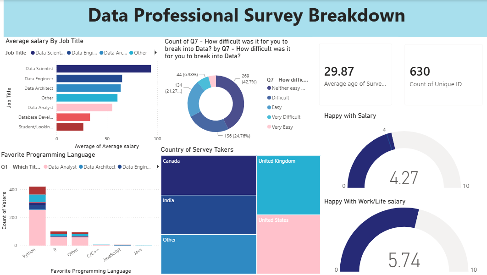

# Power BI Dashboard — Data Professional Survey Breakdown

## Overview
Built an interactive Power BI dashboard analyzing survey responses from data professionals, covering job titles, salaries, and job satisfaction.

## What I Did
- Built card visuals showing total respondents and average age
- Created a bar chart comparing job titles against average salary
- Built a column chart breaking down favorite programming languages by job title
- Used a treemap to show respondent distribution by country
- Added gauge visuals to track satisfaction levels (work-life balance, salary)
- Built a donut chart showing difficulty level of breaking into the data field

## Tools Used
Power BI

## Dashboard Preview

## File
`power_bi_project.pbix`

